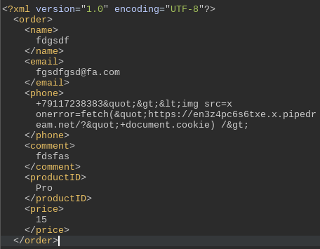

# Pentesting-Course-Notes

This repository contains my personal notes from my pentesting course. It serves as a reference for concepts and techniques that were new to me or that I found important to retain.

## Level 1: Reconnaissance on the Customer's External Infrastructure

Passive methods for searching domain names and subdomains:
- [dnsdumpster.com](https://dnsdumpster.com)
- [shodan.io](https://shodan.io)
- [censys.io](https://censys.io)
- [crt.sh](https://crt.sh)
- [pentest-tools.com](https://pentest-tools.com)

Active subdomain enumeration using amass:
```
amass enum -v -src -ip -d <site.com>
```

Data to gather during reconnaissance:

- Domain names
- "Live" IP addresses
- Open ports
- Operating system versions
- Services running on ports
- Web technologies in use

Useful tools for OSINT (Open-Source Intelligence):

- osintframework.com
- awesome-osint repository

For fast network scanning, consider using masscan.

## Level 2: Initial Access Attacks

Initial Access Attacks involve unauthorized attempts to gain access to systems, networks, or applications with the aim of acquiring the initial level of access and infiltrating them.

ffuf is a useful utility for scanning website directories:
```
ffuf -w /path/to/wordlist.txt -u http://example.com/FUZZ -fc 403
```

### Access Control in Web Applications

Access control mechanisms play a crucial role in limiting access to sensitive functions and resources to specific types of users. There are two main categories of access control: vertical access control and horizontal access control.
Vertical Access Control

* Vertical access control restricts access to sensitive functions that are not available to other user types. Insecure Function Level Access Control (IFLAC) is a subcategory of access control vulnerabilities. A vulnerable function level access control may allow attackers to access unauthorized functions for their role.
Horizontal Access Control

* Horizontal access control mechanisms limit access to resources for users who have explicitly been granted access to those resources. Insecure Direct Object References (IDOR) is also a subcategory of access control vulnerabilities.
Context-Sensitive Access Control

* Context-sensitive access control elements restrict access to functionality and resources based on the application's state or user interaction with it.

### Path Traversal or Directory Traversal

Path Traversal, also known as Directory Traversal, is a web security vulnerability that allows an attacker to read arbitrary files on the server hosting the application. Here's an example of vulnerable code:

```
<?php
$template = 'red.php';
if (isset($_COOKIE['TEMPLATE'])) {
    $template = $_COOKIE['TEMPLATE'];
}
include "/home/users/phpguru/templates/" . $template;
```

In this case, a user can manipulate the data being sent and add the string ../../../../../etc/passwd to the data sent to the server. As a result, the server will execute a request to the file located at /home/users/phpguru/templates/../../../../../etc/passwd.

### XML External Entity (XXE) Injection

XML External Entity (XXE) Injection is a web security vulnerability that allows an attacker to view files on the server's file system and interact with internal or external systems. It occurs due to vulnerabilities in the processing of external entities in XML (Extensible Markup Language).

For example, let's consider a scenario where a trading application checks the inventory level of a product by sending the following XML to the server:

```
<?xml version="1.0" encoding="UTF-8"?>
<product>
  <id>123</id>
  <name>Product XYZ</name>
  <quantity>10</quantity>
</product>
```

If the application does not implement any specific protection against XXE attacks, an attacker can exploit the XXE vulnerability to retrieve the /etc/passwd file by sending the following XXE payload:


```
<?xml version="1.0" encoding="UTF-8"?>
<!DOCTYPE foo [
  <!ENTITY xxe SYSTEM "file:///etc/passwd">
]>
<product>
  <id>123</id>
  <name>Product XYZ</name>
  <quantity>&xxe;</quantity>
</product>
```

In this case, the application will parse the external entity xxe and insert the content of the /etc/passwd file into the XML response, allowing the attacker to view sensitive information.

It's essential to implement proper input validation and secure XML parsing techniques to mitigate XXE vulnerabilities.

## Cross-Site Scripting (XSS)

Cross-Site Scripting (XSS) is a web security vulnerability that allows an attacker to compromise the interaction between users and a vulnerable application.
Types of XSS Attacks


There are three main types of XSS attacks:

- Reflected XSS: In this type of attack, the malicious script is part of the current HTTP request, and the server reflects it back in the response without proper sanitization or encoding- 
Example: 
```
https://insecure-website.com/status?message=<script>/*+Bad+stuff+here...+*/</script- 
```
- Stored XSS: Here, the malicious script is stored in the website's data store, such as a database, and is retrieved and executed when a user accesses a particular page or interacts with the vulnerable component.

Example:
```
<script>
  alert('This is a malicious script!');
  // More harmful actions...
</script>
```
- DOM-based XSS: This vulnerability exists in the client-side code rather than the server-side code. It occurs when the client-side JavaScript code dynamically manipulates the Document Object Model (DOM) without proper sanitization or validation.

Example with eval() or innerHTML:
```
var userValue = '';
document.getElementById('element').innerHTML = userValue;
```


## Key terms:

- DMZ (Demilitarized Zone): A network segment located between the external and internal networks.
- DC (Domain Controller): A server that performs account management functions.
- IDS (Intrusion Detection System): Used to detect attacks.
- IPS (Intrusion Prevention System): Used to detect and prevent attacks.
- SSRF (Server-Side Request Forgery): A vulnerability that allows an attacker to make requests from the server to other resources.
- XML (eXtensible Markup Language)
- XXE (XML External Entity)

Feel free to explore the contents of this repository. It showcases my knowledge and skills in pentesting.